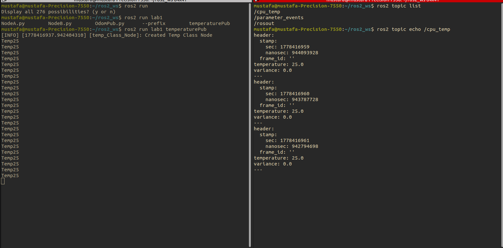
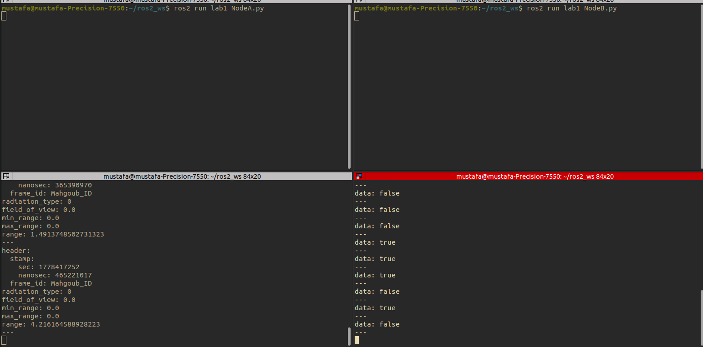

### This README is for ROS Lab 1 at ITI

---
# Task 1: CPU Temperature Publisher

### Objective: 
Build a ROS 2 C++ node to publish live CPU thermals.

### Verified Output:

# Task 2: Obstacle Detection Logic

### Objective: 
Create a two-node Python system to simulate a distance sensor and a safety trigger.

### Verified Output:

