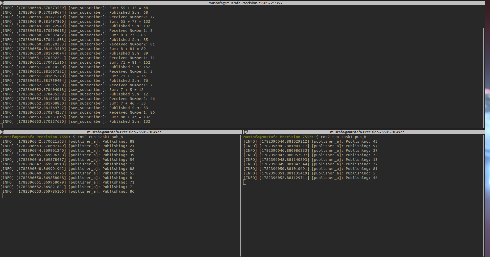

# Simple Two Numbers Sum Calculator

This task consist of three ros cpp nodes that implement a simple two numbers summation. The nodes are:
- **sub**: This node implements the calculator logic. It subscribes to the `operation` topic to receive the operation to perform and publishes the result to the `Result` topic.
- **pub_A**: This node publishes the first operand to the `Num1` topic.
- **pub_B**: This node publishes the second operand to the `Num2` topic.

